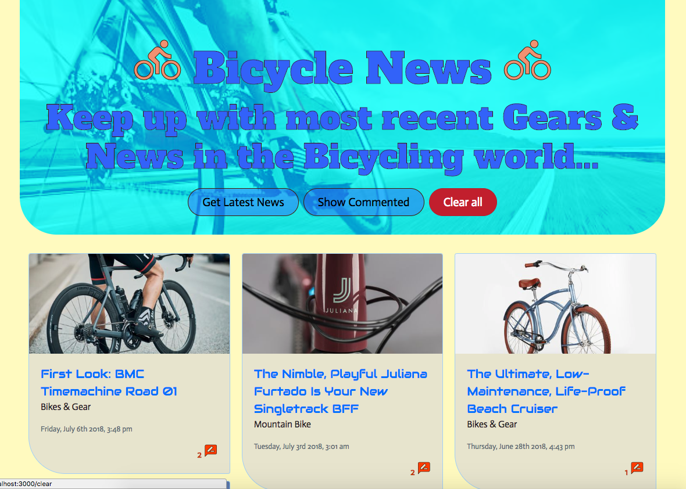
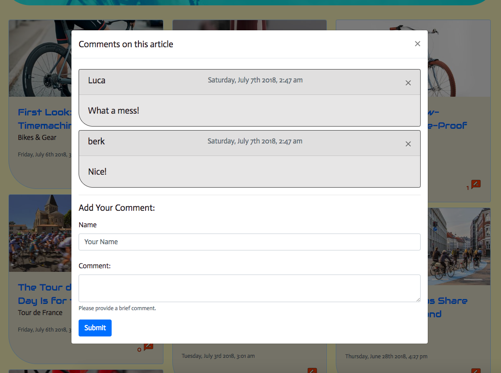

# BikeNews
## Description:
This full stack app scrapes the latest article titles and associated image from the bicycling.com website and displays thehese in form of cards in the page. The data obtained from the website is inserted into a mongo database. When users click the comment button at the bottom of each news piece (card), the exiting comments are listed in the popup modal. The user is given an option to provide their name and comment on the news piece. Upon submission of the comment form the modal is automatically updated to show the latest comment. The comments are sorted in the order so that the latest one is at the top. The number of comments per news piece is displayed next to the comment button. The users are also given an option to refresh the displayed articles and hence the database via the *Get Latest News* buttons at the top section. The users are also given the option to display only the articles with a comment via the * Show Commented* button. Finally, users can reset the page by clearing the contents and datat stored in the database via the *clear all* button. The displayed articles are sorted in the order from present to past. When the user fetches latest news with the *Get Latest News* button, if there exists data in the database the existing articles will not be overritten but only new ones will be added to the database. This is achieved by usage of `upsert: true` option for `findOneAndUpdate` operation for each article scraped from the main website. The rendering of the updated database is carried out by executiong a set of promisses pushed to an array of promisses during the comparison of existing and newly scraped articles.



With all the functionallity given above the app 
1. **Creates new enteries:** by scraping into mongoDB via the ```/fetch``` route.
1. **Creates new user comments:** by comment submission via the ```/news/<news id>``` route.
1. **Reads and displays user enteries and News:**  via the associating the comments and news models and popu;ating the later one via the ```/news/<news id>``` route. The primary display is via the ```/``` route.
3. **Updates the database:** by adding new comments to Comments modela nd populateing the associated news piece in BikeNews model via the ```/news/<news id>``` route.
4. **Deletes the enteries or all the news:** by clear button and cross buttons on comment cards via ```/clear/<news id>/<comment id>``` __delete__ route and ```/clear```  __get__ route. respectively.

Hence, complete CRUD is carried out in the the database.



## Technologies & Dependencies
### JavaScript:
Following NPM packages are used and required for the app to execute propoerly:
* Express
* Express-Handlebars
* mongo, mongoose
* bodyParser
* JQuery & Ajax
* handlebars-dateformat
* cheerio

### Frontend Framework & Technologies:
* Bootsrap 4.0
* Google Fonts
* Google Material Icons

## How it works
The gif below shows how the app works.

